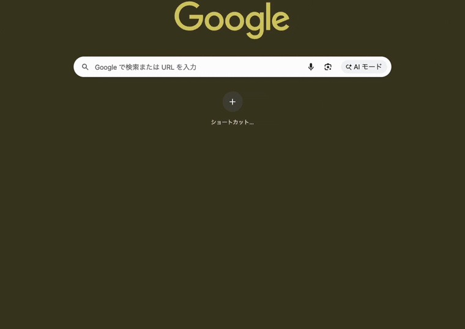

# 用語集 — wand のユビキタス言語

wand を構成する各パーツの **正規の呼び名** をまとめた規範ドキュメント。
**コード・ドキュメント・コミットメッセージ・PR タイトル・Claude Code への
プロンプト、すべてここに載っている名前のみを使う**。同義語は揺らぎを生む。
1 つに決めて、それで通す。

なお **正規名は英語のまま** 保持する。コード識別子・設定キー
（`[cast.overlay]`, `PanelController` など）と一対一に対応させるため。
日本語化するのは説明文だけ。

用語が足りなければ、その用語を導入する PR で同時にこのファイルへ追記する。
用語名を変える場合は、コード・ドキュメント・このファイルを **同一 PR で**
書き換える。

> 各エントリの形式: **正規名**, 1〜2 行の定義, 設定 / コードでの所在,
> そして `Don't call it:` 行 — このエントリが置き換える誤った呼び名のリスト。

---

## cast 面（ジェスチャー描画系）

下の GIF は Chrome 上で `DU`（下→上）を描いて `新しいタブ` ルールを
発火させた様子。中央の Chrome アイコンが `badge`、カーソルを追う青線が
`trail`、それを取り囲む各カードが `assist card`（マッチした `新しいタブ`
だけ match color で強調）。3 つの正規名がひとつの操作の中でどう同居するかを示す。

> 再生成: `swift scripts/capture-demo.swift <x> <y>` で録画し、ヘッダ記載の
> ffmpeg + gifski でクロップ → `docs/images/gesture-demo.gif` 化。

### cast
右ボタンドラッグでカーソルを動かして形（LURD 文字列）を描き、
「呪文を唱える」感覚で `[[cast.cursor.rule]]` にマッチさせ cursor-anchored
target にアクションを実行する第 1 のトリガーファミリー。`[cast]` の
`button` / `modifiers` で起動条件を切り替える。
- 設定: `[cast]`
- **Don't call it:** gesture, ジェスチャー

### assist card
カーソル周囲に配置される小さなカード。**今この瞬間ここから到達可能な方向**
を 1 方向 = 1 カードで提示する。現在マッチしているルールに対応する
カードは match color で強調される。1 行は `矢印 [icon] 名前` の
3 カラムレイアウトで、`[[cast.cursor.rule]].icon` が空でないルールでは
矢印と名前の間にアイコンが入る。退場 / 発動アニメは
`[cast.overlay.cards]` の `cancel` / `fire` / `armed` で個別に指定する。
- 設定: `[cast.overlay]` / `[cast.overlay.cards]`
- コード: `WandAdapterMacOS` overlay
- **Don't call it:** tooltip, popup, hint, chip, balloon, label, ツールチップ, ポップアップ, ヒント

> 上のキャプチャは Chrome 上で D（下）方向に描いた瞬間。中央の Chrome
> アイコン＋赤枠が `badge`、それを取り囲む `→↑ ウィンドウを閉じる`
> などの黒いカードが `assist card`。再生成するには
> `swift scripts/capture-overlays.swift docs/images`。

### badge
ジェスチャー開始点に固定表示される小さなマーカー。**ターゲットアプリの
アイコン** を表示し、キーボードフォーカスが別ウィンドウにあっても
「wand がどのウィンドウに作用するのか」を一目で示す。
- 設定: `[cast.overlay.badge]`（`enabled` / `size` / `anim-enabled`）
- **Don't call it:** icon, indicator, marker, anchor, アイコン, インジケータ

### trail
ジェスチャー描画中にカーソルを追従する半透明の軌跡。これまでに描いた
形がルールにマッチしていれば match color、マッチしなければ no-match color。
- 設定: `[cast.overlay.trail]`（`color` / `color-no-match` /
  `width` / `style` / `final-hold-ms`）
- **Don't call it:** path, stroke, line, ink, パス, 軌跡（説明文中の比喩を除く）

### cast rule
1 つの `[[cast.cursor.rule]]` エントリ。`pattern`（例: `DR`）と
アクションのペアで、必要に応じて `apps` / `filter-title` /
`filter-shell` で適用範囲を絞る。任意の `icon` は assist card 上で
名前の左に表示される（`[[tome.cursor.item]].icon` と同じ syntax）。
発動コンテキストはセクションヘッダで選ぶ: `[[cast.cursor.rule]]`
（既定・カーソル下のウィンドウを [[AX target]] として解決）と
`[[cast.focused.rule]]`（AX で解決できない面＝デスクトップ / Dock /
メニューバー用の frontmost-app フォールバック）。
- 設定: `[[cast.cursor.rule]]`（既定）/ `[[cast.focused.rule]]`（frontmost フォールバック）
- **Don't call it:** gesture, binding, mapping, shortcut, バインド, ショートカット

### wand pattern
`cast rule` がマッチ対象とする方向文字列。アルファベットは `L U R D`
のみ、連続同方向は不可（認識器が同方向の動きを 1 セグメントに集約する
ため）。
- 例: `DR`, `URD`, `L`
- **Don't call it:** shape, sequence, path, motion, 形, 軌跡

### fire burst
ジェスチャーが発動した瞬間にカーソル位置でパーティクルを放射する
クリックスルー演出。`[cast.overlay].enabled = false` でも独立に
動作する。`kind = "burst"` で有効、`kind = "off"` で無効。
- 設定: `[cast.fire.burst]`
- コード: `WandAdapterMacOS/BurstManager`
- **Don't call it:** particles, explosion, effect, flare, パーティクル, エフェクト

### fire decal
ジェスチャー発動の瞬間にカーソル位置へ描かれ、しばらく残留してから
フェードアウトする痕跡。`ink-splatter` / `paint-blob` / `scorch` /
`star` から選ぶ（`off` で無効）。trail と違って描画中ではなく
**発動の瞬間に一度だけ**置かれる。
- 設定: `[cast.fire.decal]`(`kind` / `duration-ms` / `size`)
- コード: `WandAdapterMacOS/DecalManager`
- **Don't call it:** splash, stain, mark, sticker, スタンプ, シール

### chomp
`theme = "chomp"` で有効になる特別テーマ。`trail` がアーケード風の
ペレット列＋顔スプライトに置き換わり、`assist card` や tome パネルも
そろって配色が切り替わる。スケールは `[cast.overlay.trail].width`
ではなく `[cast.chomp].size`（`s` / `m` / `l`、既定 `m`）で決まる。
cast 側は `[cast].theme`、tome 側は `[tome].theme` で個別に選ぶ。
- 設定: `[cast].theme` / `[tome].theme` / `[cast.chomp]`
- コード: `WandCore/Chomp`（`ChompSize`）/ `WandAdapterMacOS/ChompRenderer`
- **Don't call it:** pacman, パックマン, game theme, arcade theme, ゲームテーマ

### line-pet
サーフェスの輪郭を歩く小さなアーケードキャラ（`chomp` / `ghost`）。
`assist card` の枠（`[cast.overlay.cards].line-pets`）や tome パネルの
装飾（`[tome.decoration].line-pets`）に 0 個以上並べる。配列順が描画順で、
後ろのものが前を追う（`["chomp", "ghost"]` = ghost が chomp を追う）。
`[]` で無効。語彙にない名前は drop + 警告される。
- 設定: `[cast.overlay.cards].line-pets` / `[tome.decoration].line-pets`
- コード: `Palette.LinePet`（sill・語彙）/ `Effects.drawLinePets`（sill・描画）
- **Don't call it:** sprite, mascot, decoration char, スプライト, マスコット

### match color / no-match color
[[assist card]] の枠色および [[trail]] の線色を切り替える 2 色のペア。
描画中のジェスチャーが [[cast rule]] にマッチしている瞬間は
match color、まだマッチしていなければ no-match color。同時に表示中の
`assist card` のうち、現在マッチしている候補だけが match color で
強調され、ほかは通常色のまま残る。
- 設定: `[cast.overlay]`
- コード: `WandAdapterMacOS/GestureOverlay`
- **Don't call it:** active color, hit color, highlight color, success color, fail color, アクティブ色, ハイライト色, 成功色

---

## tome 面（ポップアップメニュー系）

### tome
中クリック（既定）で開く呪文書スタイルのコンテキストメニュー。
non-activating NSPanel を cursor 下にアンカーして開き、各
`[[tome.cursor.item]]` がメニュー 1 行に対応する。第 2 のトリガーファミリー。
opt-in (`[tome].enabled = true`)。
- 設定: `[tome]`
- **Don't call it:** launcher, ランチャー

### non-activating panel
tome のメインメニュー。トリガーボタンを押した瞬間に出現する
**キーボードフォーカスを奪わない浮遊パネル**（ソースアプリのフォーカスを保つ）。
ボタン押下時にカーソル下にあったウィンドウにアンカーされる。
- 設定: `[tome]`
- コード: `PanelController`
- **Don't call it:** modal, popup, window, menu, dialog, モーダル, ポップアップ, ダイアログ, ウィンドウ

### child panel
`group = [...]` を持つ行にホバーした時、[[non-activating panel]] の **隣** に
開くサブメニュー。non-activating の性質は親パネルから引き継ぐ。
- コード: `PanelController.openChild`
- **Don't call it:** submenu, dropdown, flyout, nested menu, サブメニュー, ドロップダウン

### tome entry
1 つの `[[tome.cursor.item]]` エントリ。[[non-activating panel]] もしくは
[[child panel]] に並ぶ 1 行を指す。静的なもの、`group` で child panel に
展開されるもの、`dynamic` でメニュー展開時に行を生成するものがある。
- 設定: `[[tome.cursor.item]]`
- **Don't call it:** entry, row, button, command, action, 項目, ボタン, アクション

### dynamic submenu
`dynamic = "<shell>"` を持つ `tome entry` が、メニュー展開時に
シェルコマンドを実行し、その標準出力 1 行 = 1 子行として
`template-*` フィールドを適用して生成する [[child panel]]。500ms の
ハードタイムアウトあり。
- 設定: `[[tome.cursor.item]]` で `dynamic` 指定時
- **Don't call it:** generated submenu, shell submenu, computed menu, 動的メニュー

### tome layout
[[non-activating panel]] の並びモード。`list`（縦並び、デフォルト）/
`toolbar`（横並び、アイコンのみ）/ `labeled-toolbar`（横並び、ラベル付き）
の 3 つ。`[tome].layout` でデーモン全体、`tome --open --items`
のファイル内の `[tome].layout` でその呼び出し限定に切り替えられる。
- 設定: `[tome].layout`
- **Don't call it:** orientation, mode, panel style, 並び順
  （`layout` 単体は `[tome].layout` のキー名なので可。「並びモード」
  を指す名詞としては `tome layout` を使う）

### DnD sort
[[non-activating panel]] / [[child panel]] の行をマウスドラッグで
並び替える操作。並び順は **session-only** — デーモン再起動・
config reload（`ConfigWatcher` 含む）で破棄され、config.toml の
記述順が正に戻る。`list` layout のみ（toolbar 系は対象外）。
[[dynamic submenu]] の生成行と [[external trigger]] 経由のパネルは
並び替え不可。config.toml への永続化は別 issue（surgical writer）。
- コード: `LauncherOrder.apply`（Core の slot-merge）、
  `PanelController.handleReorderDrop`
- **Don't call it:** drag sort, reorder mode, 並べ替えモード

### excludes
cast と tome を **特定のアプリ内で完全に無効化** する
グローバルブロックリスト。bundle id の glob 配列で、トリガー判定の
最初に短絡するためルール / アイテム個別の `apps` よりも上位で効く。
- 設定: `[exclude].apps`
- **Don't call it:** blacklist, blocklist, denylist, ignore list,
  ブラックリスト, 除外リスト

---

## ターゲティング

### external trigger
トリガー（chord のホットキーやテキスト選択監視など）が
`wand tome --open --items <PATH> --at <X> <Y>` 経由で tome を
呼び出す経路。ボタン押下に紐付かないため [[AX target]] では解決
できず、**フロントモストアプリを対象**として spine の例外扱い
となる。`--selection` で `$WAND_SELECTION`、`--title` で
`WAND_TARGET_TITLE` を呼び出し側から上書きできる。
- コード: `Sources/WandApp/Controller.swift` の `handleShowMenu`
- **Don't call it:** remote menu, ipc menu, dnc menu,
  リモートメニュー, 外部メニュー

### AX target
**ボタンを押した瞬間にカーソルが乗っていたウィンドウ**。キーボード
フォーカスが別ウィンドウにあっても、すべてのアクションはこの
ウィンドウに対して実行される。AX ウォークで解決を試み、失敗時は
`CGWindowListCopyWindowInfo` にフォールバック（Chrome のレンダラ
プロセスなどが対象）。
- ログ行: `AX: resolved … via ax-walk` / `via cg-window`
- shell アクションに渡される環境変数: `WAND_TARGET_BUNDLE_ID`,
  `WAND_TARGET_PID`, `WAND_TARGET_TITLE`, `WAND_TARGET_FRAME`
- **Don't call it:** focused window, active window, frontmost window,
  target app, フォーカスウィンドウ, アクティブウィンドウ
  （frontmost / focused は AX target と一致しないことがある）

### `$WAND_SELECTION`
tome トリガー発火の瞬間に、フォーカスされている要素で選択
されていたテキスト。`shell` 系 [[tome entry]] に環境変数として
渡される。何も選択されていない場合、もしくはフォーカス先のアプリ
が AX selection を公開していない場合は **unset**（空文字列ではない
— `[ -n "${WAND_SELECTION:-}" ]` で有無を判定できる）。
**信頼できない値**としてシェル内では必ずクォートすること。
- **Don't call it:** `$SELECTION`（旧名・wand#137 で廃止）, clipboard,
  highlighted text, current selection, クリップボード,
  選択範囲（コード側 AX の "current selection" と衝突するため）

### env-var contract
wand が `shell` アクションへ context を渡す環境変数の規約
（wand#137）: (1) すべて `WAND_` prefix、(2) 存在しない context の
変数は unset（空文字を入れない）、(3) 値は untrusted としてシェル内
で必ずクォート。trigger 族が増えても変数を 1 個足すだけで済む
（例: `$WAND_SHELF_FILES` / `$WAND_CLIPBOARD` は予約済みの将来枠）。
- コード: `Dispatch.execute(extraEnv:)`（`WAND_` prefix を強制）
- **Don't call it:** env spec, variable convention, 環境変数仕様

---

## エントリ追加時のルール

- 1 つの概念につき正規名は 1 つ。複数の呼び方が流通しているなら、
  このファイルで勝者を選び、敗者は `Don't call it:` 行に並べる。
- 正規名は **英語のまま小文字で書く**。コード識別子・設定キー
  （`[[cast.cursor.rule]]`, `PanelController`）はその表記を維持する。
- 定義は **1〜2 文** に収める。動作の詳細は設定セクションやソース
  ファイルへリンクし、ここで説明し直さない。
- 用語にスクリーンショットを付ける場合は `docs/images/` に置き、
  `` の形で埋め込む。
- **コードと剥離させない**: 設定キー / コード識別子（`[[cast.cursor.rule]]`,
  `[cast.chomp]`, `Palette.LinePet` など）や CLI の verb（`wand <domain> --<verb>`）
  を変更・追加・廃止したら、必ず同一 PR でこのファイルの該当箇所も書き換える。
  パーサが drop する旧綴り（例: 旧 `[[cast.rule]]` / `[[tome.item]]`、旧フラグ CLI
  `--show-menu`）を live shape の説明に使わない（それらは移行警告の中だけに残す）。
