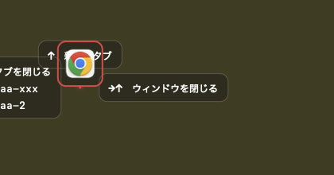

# 用語集 — wand のユビキタス言語

wand を構成する各パーツの **正規の呼び名** をまとめた規範ドキュメント。
**コード・ドキュメント・コミットメッセージ・PR タイトル・Claude Code への
プロンプト、すべてここに載っている名前のみを使う**。同義語は揺らぎを生む。
1 つに決めて、それで通す。

なお **正規名は英語のまま** 保持する。コード識別子・設定キー
（`[gesture.overlay]`, `PanelController` など）と一対一に対応させるため。
日本語化するのは説明文だけ。

用語が足りなければ、その用語を導入する PR で同時にこのファイルへ追記する。
用語名を変える場合は、コード・ドキュメント・このファイルを **同一 PR で**
書き換える。

> 各エントリの形式: **正規名**, 1〜2 行の定義, 設定 / コードでの所在,
> そして `Don't call it:` 行 — このエントリが置き換える誤った呼び名のリスト。

---

## ジェスチャー面

### assist card
カーソル周囲に配置される小さなカード。**今この瞬間ここから到達可能な方向**
を 1 方向 = 1 カードで提示する。現在マッチしているルールに対応する
カードは match color で強調される。
- 設定: `[gesture.overlay]`
- コード: `WandAdapterMacOS` overlay
- **Don't call it:** tooltip, popup, hint, chip, balloon, label, ツールチップ, ポップアップ, ヒント

> 上のキャプチャは Chrome 上で D（下）方向に描いた瞬間。中央の Chrome
> アイコン＋赤枠が `badge`、それを取り囲む `→↑ ウィンドウを閉じる`
> などの黒いカードが `assist card`。再生成するには
> `swift scripts/capture-overlays.swift docs/images`。

### badge
ジェスチャー開始点に固定表示される小さなマーカー。**ターゲットアプリの
アイコン** を表示し、キーボードフォーカスが別ウィンドウにあっても
「wand がどのウィンドウに作用するのか」を一目で示す。
- 設定: `[gesture.overlay]` の `badge` トグル
- **Don't call it:** icon, indicator, marker, anchor, アイコン, インジケータ

### trail
ジェスチャー描画中にカーソルを追従する半透明の軌跡。これまでに描いた
形がルールにマッチしていれば match color、マッチしなければ no-match color。
- 設定: `[gesture.overlay]`
- **Don't call it:** path, stroke, line, ink, パス, 軌跡（説明文中の比喩を除く）

### gesture rule
1 つの `[[gesture.rule]]` エントリ。`pattern`（例: `DR`）と
アクションのペアで、必要に応じて `apps` / `filter-title` / `filter-shell`
で適用範囲を絞る。
- 設定: `[[gesture.rule]]`
- **Don't call it:** gesture, binding, mapping, shortcut, バインド, ショートカット

### wand pattern
`gesture rule` がマッチ対象とする方向文字列。アルファベットは `L U R D`
のみ、連続同方向は不可（認識器が同方向の動きを 1 セグメントに集約する
ため）。
- 例: `DR`, `URD`, `L`
- **Don't call it:** shape, sequence, path, motion, 形, 軌跡

---

## ランチャー面

### non-activating panel
ランチャーのメインメニュー。トリガーボタンを押した瞬間に出現する
**キーボードフォーカスを奪わない浮遊パネル**（PopClip パリティ）。
ボタン押下時にカーソル下にあったウィンドウにアンカーされる。
- 設定: `[launcher]`
- コード: `PanelController`
- **Don't call it:** modal, popup, window, menu, dialog, モーダル, ポップアップ, ダイアログ, ウィンドウ

### child panel
`group = [...]` を持つ行にホバーした時、non-activating panel の **隣** に
開くサブメニュー。non-activating の性質は親パネルから引き継ぐ。
- コード: `PanelController.openChild`
- **Don't call it:** submenu, dropdown, flyout, nested menu, サブメニュー, ドロップダウン

### launcher item
1 つの `[[launcher.item]]` エントリ。non-activating panel もしくは
child panel に並ぶ 1 行を指す。静的なもの、`group` で child panel に
展開されるもの、`dynamic` でメニュー展開時に行を生成するものがある。
- 設定: `[[launcher.item]]`
- **Don't call it:** entry, row, button, command, action, 項目, ボタン, アクション

### dynamic submenu
`dynamic = "<shell>"` を持つ `launcher item` が、メニュー展開時に
シェルコマンドを実行し、その標準出力 1 行 = 1 子行として
`template-*` フィールドを適用して生成する child panel。500ms の
ハードタイムアウトあり。
- 設定: `[[launcher.item]]` で `dynamic` 指定時
- **Don't call it:** generated submenu, shell submenu, computed menu, 動的メニュー

---

## ターゲティング

### AX target
**ボタンを押した瞬間にカーソルが乗っていたウィンドウ**。キーボード
フォーカスが別ウィンドウにあっても、すべてのアクションはこの
ウィンドウに対して実行される。AX ウォークで解決を試み、失敗時は
`CGWindowListCopyWindowInfo` にフォールバック（Chrome のレンダラ
プロセスなどが対象）。
- ログ行: `AX: resolved … via ax-walk` / `via cg-window`
- shell アクションに渡される環境変数: `WAND_TARGET_BUNDLE_ID`,
  `WAND_TARGET_PID`, `WAND_TARGET_TITLE`, `WAND_TARGET_FRAME`
- **Don't call it:** focused window, active window, frontmost window,
  target app, フォーカスウィンドウ, アクティブウィンドウ
  （frontmost / focused は AX target と一致しないことがある）

### `$SELECTION`
ランチャートリガー発火の瞬間に、フォーカスされている要素で選択
されていたテキスト。`shell` 系 launcher item に環境変数として
渡される。何も選択されていない場合、もしくはフォーカス先のアプリ
が AX selection を公開していない場合は空文字列。**信頼できない値**
としてシェル内では必ずクォートすること。
- **Don't call it:** clipboard, highlighted text, current selection,
  クリップボード, 選択範囲（コード側 AX の "current selection" と衝突するため）

---

## エントリ追加時のルール

- 1 つの概念につき正規名は 1 つ。複数の呼び方が流通しているなら、
  このファイルで勝者を選び、敗者は `Don't call it:` 行に並べる。
- 正規名は **英語のまま小文字で書く**。コード識別子・設定キー
  （`[[gesture.rule]]`, `PanelController`）はその表記を維持する。
- 定義は **1〜2 文** に収める。動作の詳細は設定セクションやソース
  ファイルへリンクし、ここで説明し直さない。
- 用語にスクリーンショットを付ける場合は `docs/images/` に置き、
  `` の形で埋め込む。
