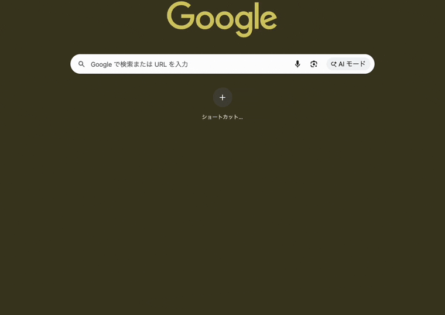
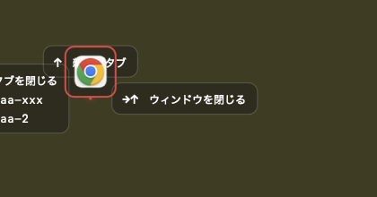

# Glossary — wand's ubiquitous language

The normative document collecting the **canonical names** for every part of
wand. **Code, docs, commit messages, PR titles, and prompts to Claude Code all
use only the names listed here.** Synonyms breed drift: pick one name and use
it everywhere.

Canonical names are kept **in English**, in one-to-one correspondence with
code identifiers and config keys (`[cast.overlay]`, `PanelController`, …).

When a term is missing, add it to this file in the same PR that introduces it.
When a term is renamed, rewrite the code, the docs, and this file **in the
same PR**.

> Entry format: **canonical name**, a 1–2 line definition, where it lives in
> config / code, and a `Don't call it:` line — the wrong names this entry
> replaces.

---

## The cast surface (gesture drawing)

The GIF below shows a `DU` (down, then up) drawn over Chrome firing the
"New Tab" rule. The Chrome icon at the centre is the `badge`, the blue line
following the cursor is the `trail`, and the cards surrounding it are the
`assist card`s (only the matched "New Tab" card is highlighted in the match
color). It shows how the three canonical names coexist inside one operation.

> Regenerate: record with `swift scripts/capture-demo.swift <x> <y>`, then
> crop with the ffmpeg + gifski commands in that script's header →
> `docs/images/gesture-demo.gif`.

### cast
The first trigger family: drag with the right button to draw a shape (an LURD
string) with the cursor — "casting a spell" — matching it against a
`[[cast.cursor.rule]]` and running the action on the cursor-anchored target.
`[cast]`'s `button` / `modifiers` switch the activation condition.
- Config: `[cast]`
- **Don't call it:** gesture

### assist card
The small cards placed around the cursor, presenting **the directions
reachable from this exact moment** — one direction = one card. The card for
the currently-matched rule is highlighted in the match color. A row is the
three-column layout `arrow [icon] name`; rules with a non-empty
`[[cast.cursor.rule]].icon` get an icon between the arrow and the name. The
exit / fire animations are set individually via `[cast.overlay.cards]`'s
`cancel` / `fire` / `armed`.
- Config: `[cast.overlay]` / `[cast.overlay.cards]`
- Code: the `WandAdapterMacOS` overlay
- **Don't call it:** tooltip, popup, hint, chip, balloon, label

> The capture above is the moment a D (down) is drawn over Chrome. The Chrome
> icon + red frame at the centre is the `badge`; the black cards surrounding
> it (`→↑ Close Window`, …) are the `assist card`s. Regenerate with
> `swift scripts/capture-overlays.swift docs/images`.

### badge
The small marker pinned at the gesture's start point. Shows **the target
app's icon**, making it obvious at a glance which window wand will act on
even when keyboard focus is in another window.
- Config: `[cast.overlay.badge]` (`enabled` / `size` / `anim-enabled`)
- **Don't call it:** icon, indicator, marker, anchor

### trail
The translucent track following the cursor while a gesture is drawn. If the
shape drawn so far matches a rule it uses the match color, otherwise the
no-match color.
- Config: `[cast.overlay.trail]` (`color` / `color-no-match` / `width` /
  `style` / `final-hold-ms`)
- **Don't call it:** path, stroke, line, ink (metaphors inside prose are fine)

### cast rule
One `[[cast.cursor.rule]]` entry. A pair of a `pattern` (e.g. `DR`) and an
action, optionally scoped with `apps` / `filter-title` / `filter-shell`. The
optional `icon` is shown left of the name on the assist card (same syntax as
`[[tome.cursor.item]].icon`). The firing context is chosen by the section
header: `[[cast.cursor.rule]]` (default — resolves the window under the
cursor as the [[AX target]]) and `[[cast.focused.rule]]` (the frontmost-app
fallback for surfaces AX cannot resolve — desktop / Dock / menu bar).
- Config: `[[cast.cursor.rule]]` (default) / `[[cast.focused.rule]]`
  (frontmost fallback)
- **Don't call it:** gesture, binding, mapping, shortcut

### pattern
The direction string a `cast rule` matches against — the `pattern` key of
a `[[cast.cursor.rule]]`. The alphabet is only `L U R D`; consecutive same
directions are impossible (the recognizer collapses same-direction movement
into one segment).
- Config: `[[cast.cursor.rule]].pattern`
- Examples: `DR`, `URD`, `L`
- **Don't call it:** shape, sequence, path, motion, gesture string

### intensity
The cast-wide multiplier (`subtle` / `normal` / `bold` / `wild`) applied to
every visual effect a firing cast produces — the [[assist card]] exit
animations and the [[fire burst]]. The [[fire decal]] has its own size /
duration and is not scaled. Lives at `[cast]` level on purpose because it
spans two sub-blocks.
- Config: `[cast].intensity`
- **Don't call it:** scale, strength, effect level

### armed cue
The continuous cue on the [[assist card]] that would fire if the button
were released right now, shown while the stroke is still in progress
(`pulse` / `glow` / `shake` / `sparkle` / `marching`; `off` disables).
Distinct from `fire`, which is one-shot at button-up.
- Config: `[cast.overlay.cards].armed`
- **Don't call it:** highlight, active state, pre-fire animation

### no-match banner
The banner shown at the cursor once the in-progress gesture has fallen off
every reachable rule. `kind = "game-over"` draws the arcade-style
"GAME OVER" overlay; `off` disables. Independent of `[cast].theme`
(chomp's red wall-flash is a separate, theme-specific cue).
- Config: `[cast.overlay.no-match]`
- **Don't call it:** GAME OVER screen, fail banner, error overlay

### fire burst
The click-through effect radiating particles at the cursor position the
moment a gesture fires. Works independently even with
`[cast.overlay].enabled = false`. `kind = "burst"` enables, `kind = "off"`
disables.
- Config: `[cast.fire.burst]`
- Code: `WandAdapterMacOS/BurstManager`
- **Don't call it:** particles, explosion, effect, flare

### fire decal
The mark drawn at the cursor position the moment a gesture fires, lingering
for a while before fading out. Choose from `ink-splatter` / `paint-blob` /
`scorch` / `star` (`off` disables). Unlike the trail it is placed **once, at
the moment of firing**, not while drawing.
- Config: `[cast.fire.decal]` (`kind` / `duration-ms` / `size`)
- Code: `WandAdapterMacOS/DecalManager`
- **Don't call it:** splash, stain, mark, sticker

### chomp
The special theme enabled by `theme = "chomp"`. The `trail` is replaced by an
arcade-style pellet row + face sprite, and the `assist card`s and tome panel
switch their palette in concert. Scale is decided by `[cast.chomp].size`
(`s` / `m` / `l`, default `m`), not `[cast.overlay.trail].width`. The cast
side picks it via `[cast].theme`, the tome side independently via
`[tome].theme`.
- Config: `[cast].theme` / `[tome].theme` / `[cast.chomp]`
- Code: `WandCore/Chomp` (`ChompSize`) / `WandAdapterMacOS/ChompRenderer`
- **Don't call it:** pacman, game theme, arcade theme

### line-pet
The small arcade characters (`chomp` / `ghost`) walking the outline of a
surface. Zero or more line up on the `assist card` frame
(`[cast.overlay.cards].line-pets`) or the tome panel's decoration
(`[tome.decoration].line-pets`). Array order is draw order; a later one
chases the one before it (`["chomp", "ghost"]` = the ghost chases the chomp).
`[]` disables. A name outside the vocabulary is dropped with a warning.
- Config: `[cast.overlay.cards].line-pets` / `[tome.decoration].line-pets`
- Code: `Palette.LinePet` (sill, the vocabulary) / `Effects.drawLinePets`
  (sill, the drawing)
- **Don't call it:** sprite, mascot, decoration char

### match color / no-match color
The two-color pair switching the [[assist card]] frame color and the
[[trail]] line color. The moment the gesture being drawn matches a
[[cast rule]] it shows the match color; before that, the no-match color. Of
the `assist card`s on screen, only the currently-matched candidate is
highlighted in the match color — the rest stay in the normal color.
- Config: `[cast.overlay]`
- Code: `WandAdapterMacOS/CastOverlay`
- **Don't call it:** active color, hit color, highlight color, success
  color, fail color

---

## The tome surface (popup menu)

### tome
The spellbook-style context menu opened by middle click (default). Opens a
non-activating NSPanel anchored under the cursor; each `[[tome.cursor.item]]`
is one menu row. The second trigger family. Opt-in
(`[tome].enabled = true`).
- Config: `[tome]`
- **Don't call it:** launcher

### non-activating panel
tome's main menu. The **floating panel that never steals keyboard focus**
(the source app keeps focus), appearing the moment the trigger button is
pressed. Anchored to the window that was under the cursor at button-press.
- Config: `[tome]`
- Code: `PanelController`
- **Don't call it:** modal, popup, window, menu, dialog

### child panel
The submenu that opens **next to** the [[non-activating panel]] when a row
with `group = [...]` is hovered. Inherits the non-activating nature from its
parent panel.
- Code: `PanelController.openChild`
- **Don't call it:** submenu, dropdown, flyout, nested menu

### tome entry
One `[[tome.cursor.item]]` entry — one row in the [[non-activating panel]]
or a [[child panel]]. Comes in three kinds: static, `group` (expands into a
child panel), and `dynamic` (generates rows when the menu opens).
- Config: `[[tome.cursor.item]]`
- **Don't call it:** entry, row, button, command, action

### dynamic submenu
The [[child panel]] a `tome entry` with `dynamic = "<shell>"` generates when
the menu opens: it runs the shell command and turns each stdout line into
one child row through the `template-*` fields. Hard 500ms timeout.
- Config: a `[[tome.cursor.item]]` with `dynamic` set
- **Don't call it:** generated submenu, shell submenu, computed menu

### tome layout
The [[non-activating panel]]'s arrangement mode: `list` (vertical, default) /
`toolbar` (horizontal, icons only) / `labeled-toolbar` (horizontal, with
labels). `[tome].layout` switches the whole daemon; a `[tome].layout` inside
a `tome --open --items` file switches just that invocation.
- Config: `[tome].layout`
- **Don't call it:** orientation, mode, panel style (`layout` alone is fine —
  it is the `[tome].layout` key name; as the noun for the arrangement mode,
  use `tome layout`)

### DnD sort
Reordering the rows of the [[non-activating panel]] / [[child panel]] by
mouse drag. The order is **session-only** — discarded on daemon restart or
config reload (including `ConfigWatcher`), when the config.toml order becomes
canonical again. `list` layout only (the toolbar variants are excluded). Rows
generated by a [[dynamic submenu]] and panels opened via an
[[external trigger]] cannot be reordered. Persisting into config.toml is a
separate issue (the surgical writer).
- Code: `LauncherOrder.apply` (Core's slot-merge),
  `PanelController.handleReorderDrop`
- **Don't call it:** drag sort, reorder mode

### excludes
The global blocklist that **fully disables cast and tome inside specific
apps**. An array of bundle-id globs, short-circuiting at the top of trigger
evaluation — so it outranks per-rule / per-item `apps`.
- Config: `[exclude].apps`
- **Don't call it:** blacklist, blocklist, denylist, ignore list

---

## Targeting

### external trigger
The path where a trigger (a chord hotkey, a text-selection watcher, …) opens
tome via `wand tome --open --items <PATH> --at <X> <Y>`. Not tied to a
button press, so it cannot resolve an [[AX target]] and instead **targets the
frontmost app** — the spine's one exception. `--selection` overrides
`$WAND_SELECTION` and `--title` overrides `WAND_TARGET_TITLE` from the
calling side.
- Code: `handleShowMenu` in `Sources/WandApp/Controller.swift`
- **Don't call it:** remote menu, ipc menu, dnc menu

### AX target
**The window the cursor was over at the moment the button was pressed.**
Every action runs against this window even when keyboard focus is elsewhere.
Resolution first tries an AX walk, then falls back to
`CGWindowListCopyWindowInfo` (for Chrome renderer processes and the like).
- Log lines: `AX: resolved … via ax-walk` / `via cg-window`
- Environment variables passed to shell actions: `WAND_TARGET_BUNDLE_ID`,
  `WAND_TARGET_PID`, `WAND_TARGET_TITLE`, `WAND_TARGET_FRAME`
- **Don't call it:** focused window, active window, frontmost window, target
  app (frontmost / focused can differ from the AX target)

### `$WAND_SELECTION`
The text selected in the focused element at the moment the tome trigger
fired. Passed as an environment variable to `shell`-type [[tome entry]]s.
When nothing is selected, or the focused app does not expose an AX
selection, it is **unset** (not an empty string — test presence with
`[ -n "${WAND_SELECTION:-}" ]`). An **untrusted value**: always quote it
inside shell.
- **Don't call it:** `$SELECTION` (the old name, retired in wand#137),
  clipboard, highlighted text, current selection (collides with AX's
  "current selection" on the code side)

### env-var contract
The convention for the environment variables wand passes to `shell` actions
(wand#137): (1) all `WAND_`-prefixed, (2) a variable for absent context is
unset (never an empty string), (3) values are untrusted — always quote them
in shell. Growing the trigger family only ever costs one more variable
(e.g. `$WAND_SHELF_FILES` / `$WAND_CLIPBOARD` are reserved future slots).
- Code: `Dispatch.execute(extraEnv:)` (enforces the `WAND_` prefix)
- **Don't call it:** env spec, variable convention

---

## Rules for adding entries

- One canonical name per concept. If several names are in circulation, pick
  the winner in this file and list the losers on the `Don't call it:` line.
- Canonical names are written **in English, lowercase**, keeping the exact
  spelling of code identifiers and config keys (`[[cast.cursor.rule]]`,
  `PanelController`).
- Keep a definition to **1–2 sentences**. Link behaviour details to the
  config section or the source file instead of re-explaining them here.
- A screenshot for a term goes in `docs/images/`, embedded as
  ``.
- **Never let this file drift from the code**: when a config key / code
  identifier (`[[cast.cursor.rule]]`, `[cast.chomp]`, `Palette.LinePet`, …)
  or a CLI verb (`wand <domain> --<verb>`) is changed, added, or retired,
  rewrite the matching part of this file in the same PR. Never describe the
  live shape with a spelling the parser drops (the old `[[cast.rule]]` /
  `[[tome.item]]`, the old flag CLI `--show-menu` — those stay only inside
  migration warnings).
